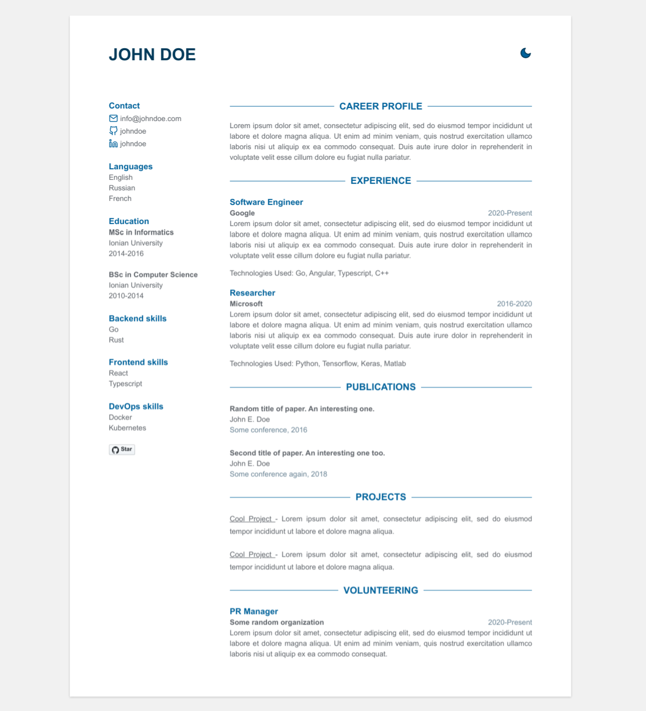

# Interactive CV — Phạm Công Thành

Static, multi-language (VI/EN/TW) interactive portfolio site.



## Project structure

```
.
├── public/                  # Site root served in production
│   ├── index.html
│   └── assets/
│       ├── css/style.css
│       └── js/
│           ├── data.js      # Resume content (personal info, experience, projects...)
│           └── app.js       # Rendering, navigation, language switching, chatbot UI
├── deploy/                  # Deployment configuration
│   ├── Dockerfile
│   ├── docker-compose.yml
│   ├── nginx.container.conf # Nginx config baked into the container
│   └── nginx.host.conf.example # Sample host-level reverse proxy + TLS
├── .github/workflows/deploy.yml # CI/CD: deploy to VPS on push to main
└── docs/                    # Repo assets (README preview image)
```

## Local development

No build step is required — it's plain HTML/CSS/JS. Serve the `public/` folder with any static file server, e.g.:

```bash
python -m http.server 5173 --directory public
```

Then open http://localhost:5173.

To edit content (name, experience, projects, skills, chatbot text...), edit [`public/assets/js/data.js`](public/assets/js/data.js). Page structure lives in [`public/index.html`](public/index.html), styling in [`public/assets/css/style.css`](public/assets/css/style.css), and behavior in [`public/assets/js/app.js`](public/assets/js/app.js).

## Deployment (Ubuntu 24 VPS)

The site runs as a small Nginx container, fronted by a host-level Nginx that terminates TLS.

### One-time server setup

```bash
# Docker
curl -fsSL https://get.docker.com | sh

# Host Nginx + certbot
sudo apt update && sudo apt install -y nginx certbot python3-certbot-nginx

# Clone the repo where CI will deploy from
git clone https://github.com/Ranma-2000/Ranma-2000.github.io.git /srv/peterpham-cv
cd /srv/peterpham-cv
docker compose -f deploy/docker-compose.yml up -d --build
```

Then configure the host reverse proxy from the template and issue a certificate:

```bash
sudo cp deploy/nginx.host.conf.example /etc/nginx/sites-available/peterpham.info.vn
sudo ln -s /etc/nginx/sites-available/peterpham.info.vn /etc/nginx/sites-enabled/
sudo nginx -t && sudo systemctl reload nginx
sudo certbot --nginx -d peterpham.info.vn -d www.peterpham.info.vn
```

### Continuous deployment

[`.github/workflows/deploy.yml`](.github/workflows/deploy.yml) SSHes into the VPS on every push to `main`, pulls the latest commit, and rebuilds the container. Configure these repository secrets:

| Secret | Description |
| --- | --- |
| `VPS_HOST` | Server IP or hostname |
| `VPS_USER` | SSH user with access to the deploy path |
| `VPS_SSH_KEY` | Private key for that user |
| `VPS_PORT` | SSH port (optional, defaults to 22) |
| `VPS_DEPLOY_PATH` | Absolute path to the cloned repo on the server, e.g. `/srv/peterpham-cv` |

## License

[MIT](./LICENSE)
